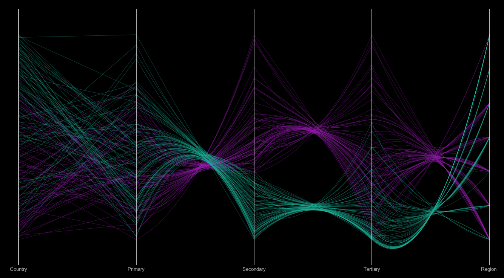
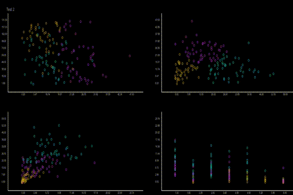
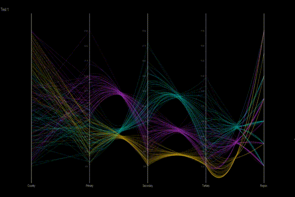

Extempore + Parallel Coordinates
================================

I finally hunted down all the memory errors! Time to get everything working.
Todo: transitions between two states

Example of clustering:

Transitions:

  

