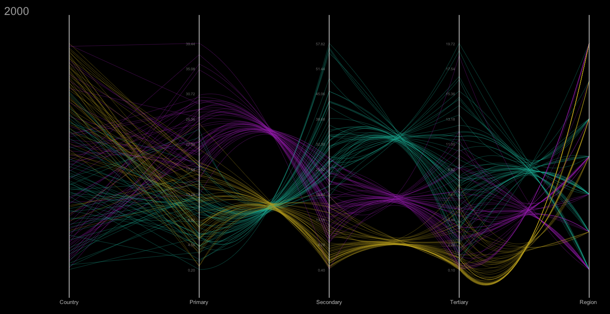

Extempore + Parallel Coordinates
================================

All the transitions are working!

[Latex for equations](http://www.hostmath.com/Show.aspx?Code=P_0%20%3D%20%5Cleft%5B%20x_0%2C%20y_0%20%5Cright%5D%2C%20P'_0%20%3D%20%5Cleft%5B%20x'_0%2C%20y'_0%20%5Cright%5D%5C%5C%0AP_1%20%3D%20%5Cleft%5B%20x_1%2C%20y_1%20%5Cright%5D%2C%20P'_1%20%3D%20%5Cleft%5B%20x'_1%2C%20y'_1%20%5Cright%5D%5C%5C%0AL%20%3D%20%5Cleft%5B%20l_x%2C%20l_y%20%5Cright%5D%2C%20L'%20%3D%20%5Cleft%5B%20l'_x%2C%20l'_y%20%5Cright%5D%5C%5C%0AC%20%3D%20%5Cleft%5B%20x_1%20-%20x_0%20%2C%20%5Cfrac%7By_1%20%2B%20y_2%20-%202L_y%20%7D%7B2%7D%20%5Cright%5D%5C%5C%0AU(t%2Cy)%20%3D%20%5Cleft%5B%20(1-t)%5Cleft%5B(1-y)%5E2x_0%20%2B%202(1-y)y(x_1-x_0)%20%2B%20y%5E2x_2%5Cright%5D%20%2B%20%5C%5C%20t%5Cleft%5B(1-y)%5E2x'_0%20%2B%202(1-y)y(x'_1-x'_0)%20%2B%20y%5E2x'_2%5Cright%5D%2C%20%20(1-t)%5Cleft%5B(1-y)%5E2y_0%20%2B%202(1-y)y%5Ccolor%7Bblue%7D%20%7B%5Cfrac%7B%5Ccolor%7Bpurple%7D%20%7B%5Cleft(0.1%20*%20%5Cfrac%7By_1-L_y-min_y%7D%7Bmax_y-min_y%7D%20%20%5Cright)%7D%20%2B%20y_2%20-%202L_y%20%7D%7B2%7D%7D%20%2B%20y%5E2y_2%5Cright%5D%20%2B%20%5C%5C%20t%5Cleft%5B(1-y)%5E2y'_0%20%2B%202(1-y)y%5Ccolor%7Bblue%7D%7B%5Cfrac%7B%5Ccolor%7Bpurple%7D%20%7B%5Cleft(0.1%20*%20%5Cfrac%7By'_1-L'_y-min_%7By'%7D%7D%7Bmax_%7By'%7D-min_%7By'%7D%7D%20%20%5Cright)%7D%20%2B%20y'_2%20-%202L'_x%20%7D%7B2%7D%7D%20%2B%20y%5E2y'_2%5Cright%5D%20%5Cright%5D)

View the presentation in the releases.

Example of clustering:

Transitions:

  

